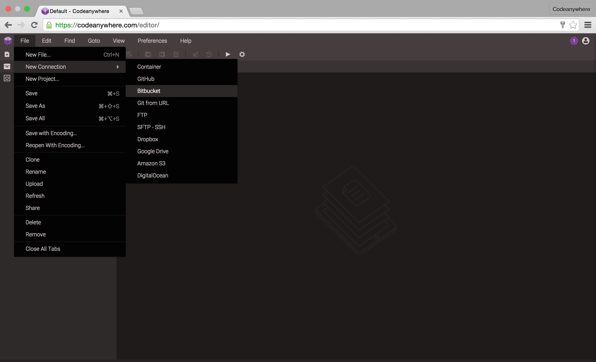
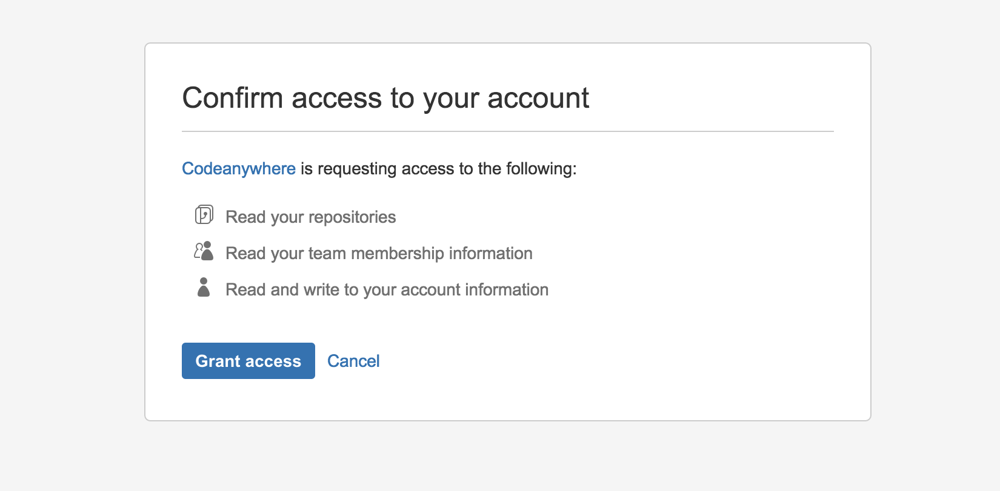
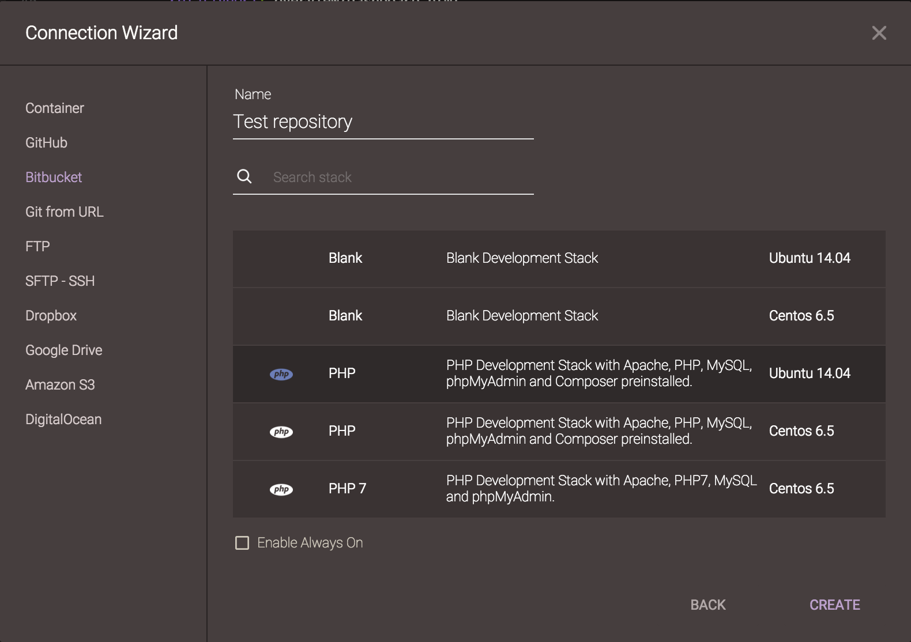

# Bitbucket

With Codeanywhere, you’ll be able to work directly with your Bitbucket repositories. CA will create a [Container](http://docs.codeanywhere.com/connections/container.html) for each repository and you will be able to edit your code directly from there. Then, you can push changes back to your repo using your SSH Terminal! Just check our [Working with Repositories section](http://docs.codeanywhere.com/connections/bitbucket.html#working-with-repositories) for further instructions.

### Creating an Bitbucket Container

Go to File -> New Connection -> Bitbucket:

After selecting it, Add Bitbucket Access window appears. Click on "Connect your Bitbucket Account" in order to proceed.

Enter Bitbucket details to connect to your Bitbucket account and authorize Codeanywhere for quick and easy access.

You’ll be prompted which repository you want to connect to.

Now just select repository you want to access, setup your development environment, or let our system decide for you!

Now you’ve created a new [Container](http://docs.codeanywhere.com/connections/container.html) with your repository!

Once you have got the repo in Codeanywhere, you can work on it from anywhere. You'll be able to edit your files, or run projects within Codeanywhere!

### Bitbucket SSH key

You can link your Codeanywhere SSH key to your Bitbucket account. That way, you can push commits to your private repo without password prompt. To do so, copy your [Codeanywhere public key](https://codeanywhere.com/dashboard#ssh-keys) and paste it to your Bitbucket account (Account -> manage account -> SSH keys -> add Key)

Now your Codeanywhere account is authorized to make changes to your repo.

If you already have repository in Bitbucket, just by cloning your repository, your git will be setup. If you have existing project with empty Bitbucket git repository, you can add your repo with "git remote add origin {GIT_SSH_URL}". You can find your {GIT_SSH_URL} by clicking clone in bitbucket repo, then copying url next to 'git clone', its format is git@bitbucket.org:/username/repository.git

### Working with repositories

You can push changes to Bitbucket using standard git commands inside your SSH terminal:

git add -A // To track all files

git commit -am "message" // To commit changes

git push origin master // Push your local changes to bitbucket

For more information see [working with repositories](http://docs.codeanywhere.com/connections/bitbucket.html#working-with-repositories)

