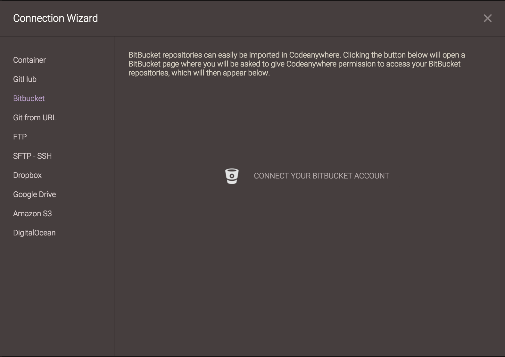
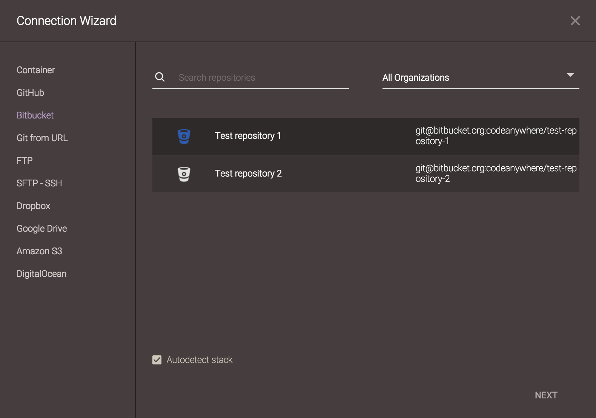

# Bitbucket

With Codeanywhere, you’ll be able to work directly with your Bitbucket repositories. 

### Creating an Bitbucket Container

Go to File -> New Connection -> Bitbucket:

After selecting it, Add Bitbucket Access window appears. Click on "Connect your Bitbucket Account" in order to proceed.

Enter Bitbucket details to connect to your Bitbucket account and authorize Codeanywhere for quick and easy access.

You’ll be prompted which repository you want to connect to.

Now just select repository you want to access, setup your development environment, or let our system decide for you!
Now you’ve created a new [Container](http://docs.codeanywhere.com/connections/container.html) with your repository!

Once you have got the repo in Codeanywhere, you can work on it from anywhere. You'll be able to edit your files, or run projects within Codeanywhere!

