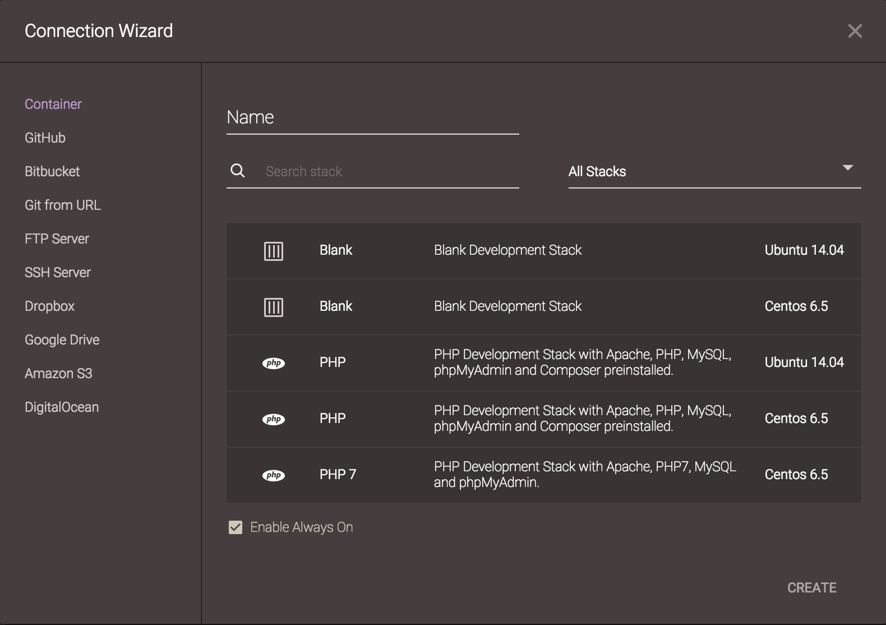
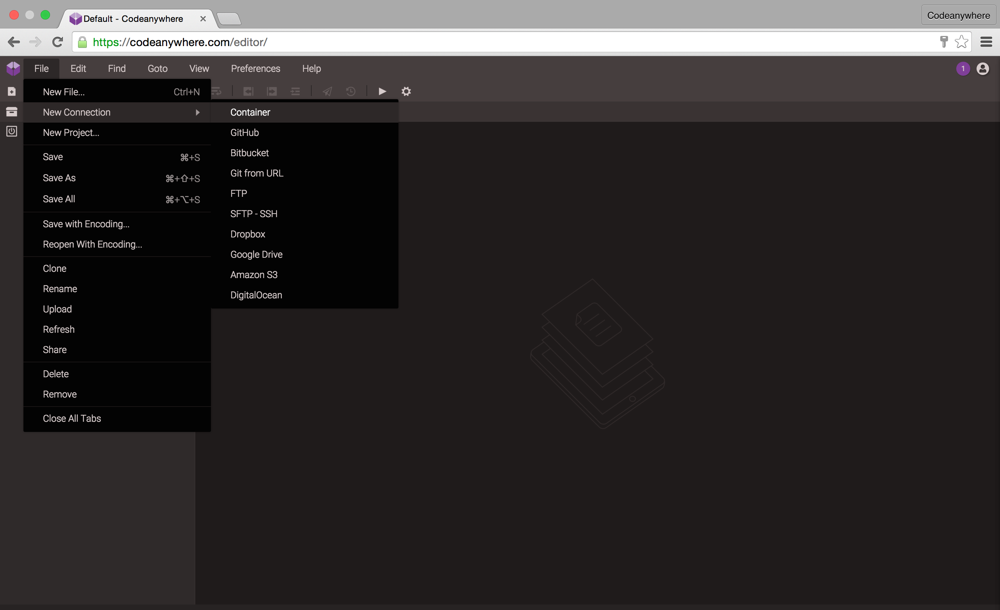
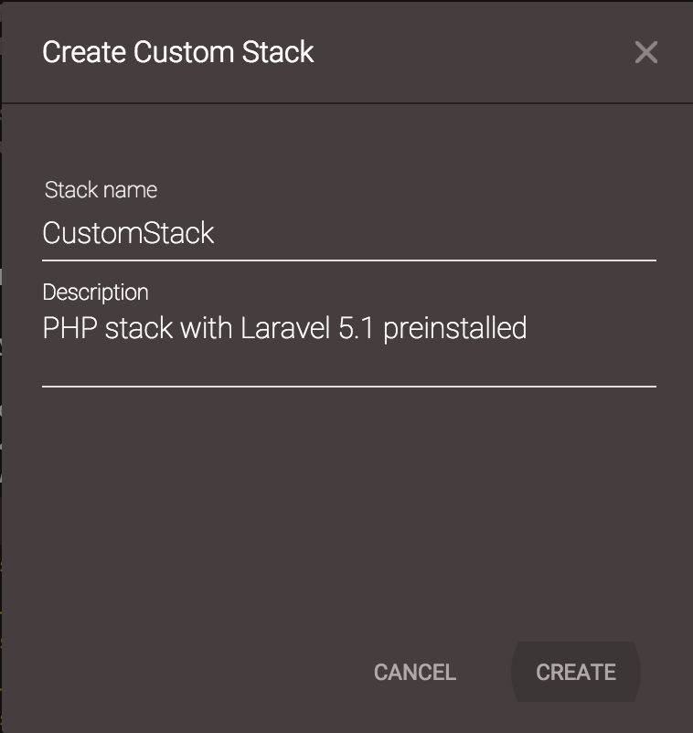

# Container

Containers are in essence your own Virtual Private Servers run invisibly in the background of Codeanywhere, each one with its own amount of RAM, Disk space and Processing power. Containers give you the ability to provision any Development Environment you like. You can even choose between one of the predefined stacks:

- Blank – Blank Development Box
- PHP – PHP Development Stack with Apache, PHP, MySQL, phpMyAdmin and Composer preinstalled
- PHP7 – PHP Development Stack with Apache, PHP7, MySQL and phpMyAdmin preinstalled (only CentOS).
- NodeJS – NodeJS Development Stack with NodeJS, MySQL, NPM, bower and grunt preinstalled
- Ruby – Ruby Development Stack with RVM and Ruby on Rails preinstalled
- Python – Python Development Stack with pip and virtualenv preinstalled
- C/C++ – C/C++ Development Stack with gcc and g++ compiler and gdb preinstalled
- HTML – HTML5 Development Stack with Apache, npm, yeoman, bower and  grunt preinstalled
- Wordpress – PHP Development Stack with Wordpress 4.2.1, Apache, PHP, MySQL, phpMyAdmin and Composer preinstalled
- Laravel – PHP Development Stack with Laravel 4.2, Apache, PHP, MySQL, phpMyAdmin and Composer preinstalled
- MEAN – NodeJS Development Stack with MEAN 0.9.20, NodeJS, bower, MongoDB, gulp and grunt preinstalled
- Symfony – PHP Development Stack with Symfony 2.6, Apache, PHP, MySQL, phpMyAdmin and Composer preinstalled
- Sails – NodeJS Development Stack with Meteor, NodeJS, NPM, bower and grunt preinstalled
- Meteor – Meteor Development Stack with Meteor, NodeJS, NPM, bower and grunt preinstalled
- EmberJS – EmberJS Development Stack with EmberJS, NodeJS, NPM, bower and grunt preinstalled
- ioJS – ioJS Development Stack with ioJS, NodeJS, NPM, bower and grunt preinstalled
- BackboneJS – BackboneJS Development Stack with BackboneJS, Apache (running on standard HTTP port – 80), NPM, bower, grunt preinstalled
- AngularJS – AngularJS Development Stack with NodeJS, MySQL, NPM, bower and grunt preinstalled
- CakePHP – PHP Development Stack with Apache (running on standard HTTP port – 80), CakePHP, PHP, MySQL (user: myapp, password: secret), and Composer preinstalled
- Drupal – PHP Development Stack with Apache (running on standard HTTP port – 80), Drupal, PHP, MySQL (myapp user secret password), phpMyAdmin and Composer preinstalled
- LoopBack – NodeJS Development Stack with LoopBack, NodeJS, MySQL, NPM, bower and grunt preinstalled
- Swift – Swift Development Stack 

You won't even be aware of it being created or started. You can choose between two operating systems: Ubuntu 14.04 and CentOS 6.5.




Also, if you require any development environment you can't find in our list, you can use your SSH terminal and create your own stack! Afterwards, just save it as a Custom Stack and you can use it again and again!
The best part of Containers is that not only does it remove issue of having your development environment wherever you are; it also enables you to connect to any GIT repository in the world, be it a corporate server or popular services like GitHub or Bitbucket. With Containers you can now finally connect to your repositories and use its full capabilities, so now you can use commit to repositories from Codeanywhere!

Create a new Container by going to File -> New Connection -> Container



Choose your environment, name it and click Create!


### Manage Container


With Container get SSH access to your Container and you can use all the necessary actions such as git commands, installation of new depencencies ect! You can Turn Off or Turn On your Box, restart it or set it to be Always On so you can access your Box at anytime, without the need of logging into your account and starting it.
With containers, you can view your code with your preview link. You can check your preview link inside Info.
 


Be sure to replace the XX with the port you have specified in your app.

In Config, you can set up commands necessary for your Stack to Run. Custom Stack can be created out of any Container! If you installed anything using your terminal, just save it as a Custom Stack and use it again and again. This way, you don't have to lose anytime for creating your development environment all over again!

By selecting Run, your preview link will be opened and any command neccessary to run your app, opened in SSH terminal.

Create any file, by entering filename.extension, or folder inside your container, Upload files directly from your local storage or Share your entire Container!
 
In case you want to delete your entire Container, just click Destroy. However, keep in mind that your work will be removed and you wont be able to retrieve it afterwards!

### PHPMyAdmin

PhpMyAdmin comes preinstalled with our Containers (both CentOS and Ubuntu). To access it first open the info by right-clicking the Container in File Explorer:
Copy the link (with the XX replaced with your port) into the new tab of your browser and add „/phpmyadmin“ at the end of the link to access phpMyAdmin – it will look something like: http://port-80.xxxxxx.box.codeanywhere.com/phpmyadmin. For login use the "root" as Username, and leave the Password field empty:
 


If you want to be able to access your Container at all times, you can activate our feature Always-on, which will keep your Container running even when you're not using Codeanywhere!

### Creating a Custom Stack

In order to create a Custom Stack of one of your Stacks, first, you'll have to right click on your Container and select Create Custom Stacks


Enter your File name and Description so you could find it easier later on!



You can access all your Custom Stacks in your [Dashboard](https://codeanywhere.com/dashboard#custom-stacks).


### Deploy to Heroku

Deploying with Heroku requires you to install Heroku toolbelt. You can install it using SSH command:

```sh	
	wget -O- https://toolbelt.heroku.com/install-ubuntu.sh | sh
```

Now you can use Heroku CLI. More detailed instruction can be found on official Heroku toolbelt website https://toolbelt.heroku.com/


### Locate Private and Public

You can view Keys of your container by going to cd /home/cabox/.ssh/ using your SSH terminal. There you will find: 
- id_rsa - private key container of your container, 
- id_rsa.pub - public key of your container.


### Connect your Container via SFTP

These are the credentials you'll need: 
- Hostname: preview link of your container - looks something like preview.xxxx.box.codeanywhere.com and you can check it in Container's Info with a right click on your Container 
- User name: cabox 
- As for the password, you can't connect this way. You'll need private key of your Container and you can get it by going to /home/cabox/.ssh/id_rsa and that's your private key which you can use for connecting to your Container. 
- Also, you'll need to check your Port - right click on your Container, select Info, locate SSH Terminal listening on port, and that's the port you have to use for connecting to SFTP.

Containers are available to all users, just login and try it out!