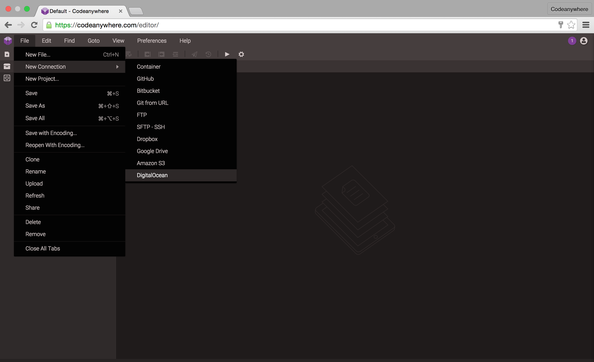
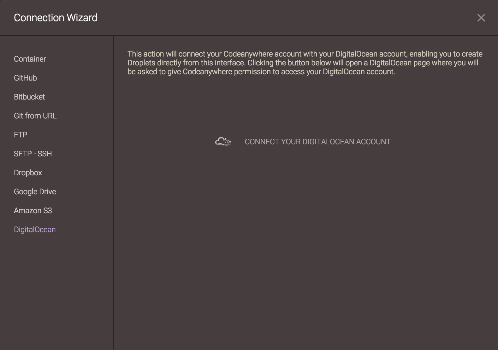
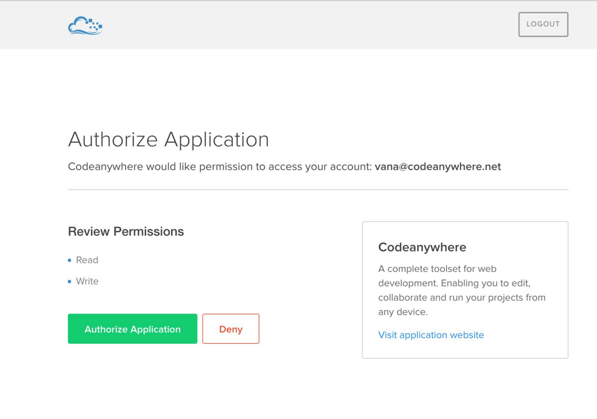
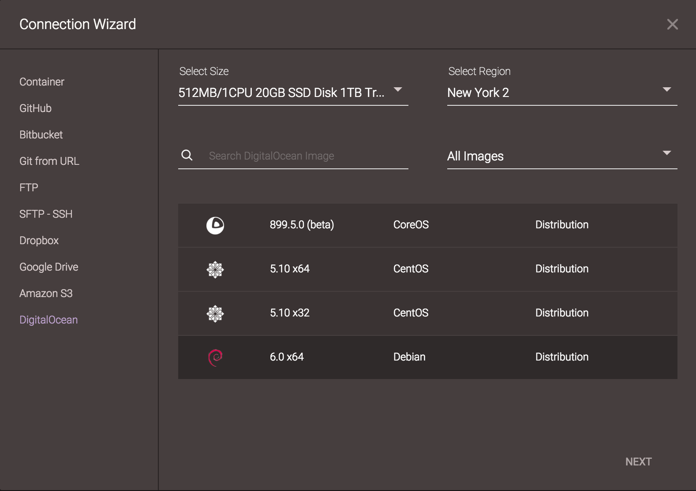
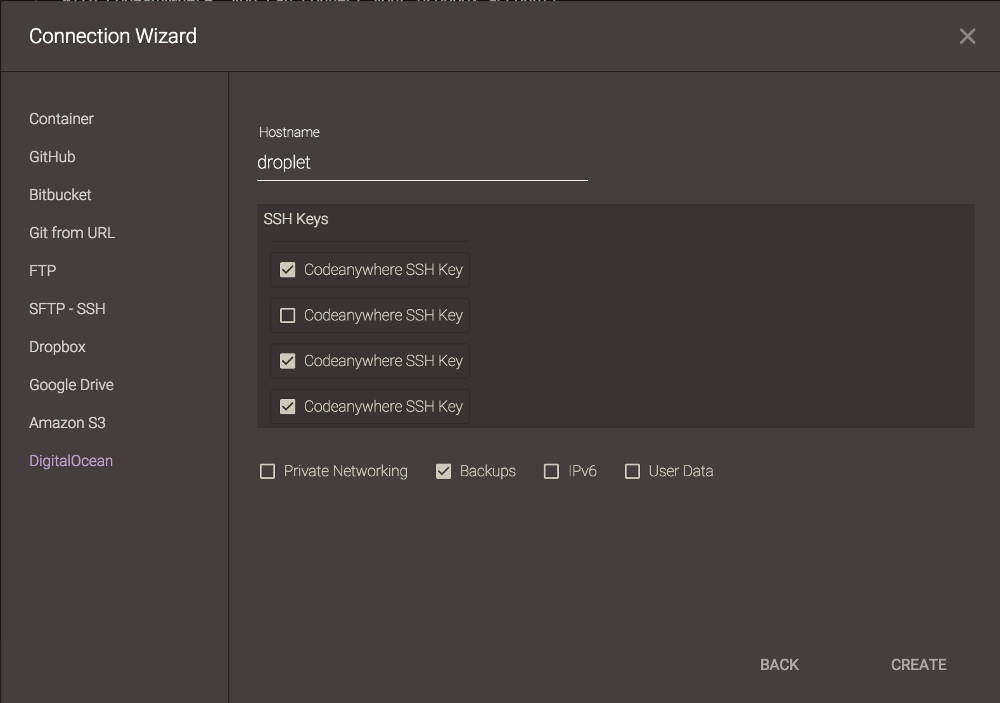
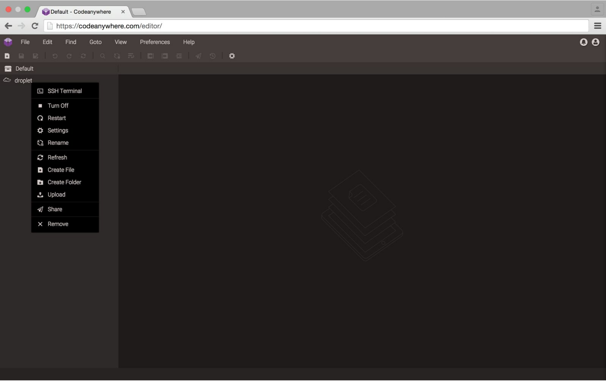
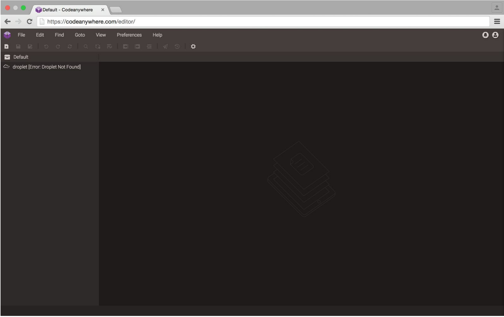
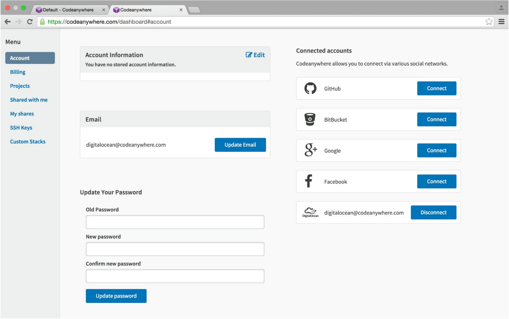

# DigitalOcean

With Codeanywhere, you can work directly with your DigitalOcean Droplets!

### Adding a New Connection to DigitalOcean

In order to create a new Droplet using Codeanywhere, simply go to File  -> New Connection -> DigitalOcean. 

After selecting DigitalOcean, Add DigitalOcean Access window appears. Click on "Connect your DigitalOcean Account" in order to proceed. 

Enter your Digital Ocean account details to log in and connect to your Digital Ocean account and authorize Codeanywhere for quick and easy access!

Now, in your Editor, you’ll be able to create a new Droplet which will be added to your Digital Ocean account.

### Creating a new Droplet

First of all, you can select your new Droplet image from 4 categories: Distributions, One-click Apps, Snapshots and Backups. Also, here, you can select Droplet’s Size, as well as Region of your Droplet - the same way you do that with Digital Ocean! 

After selecting Next, you can enter Host name of your Droplet which will also be shown in your Codeanywhere file tree, as well as in your Digital Ocean account, SSH Keys you’d like to import and any Additional Add-on you’d like to select. 

Click Create and your Droplet will be added into your Codeanywhere account and to your Digital Ocean account!

### Managing a Droplet

With Codeanywhere, you get SSH access to your Droplet and you can use all the necessary actions! Also, you can use other actions: 
  - Turn Off / Start - power off your Droplet at any time and turn it on again, 
  - Restart - reboot your Droplet, 
  - Settings - change settings of your Droplet, 
  - Rename - change Host name, 
  - Refresh - refresh Droplet, 
  - Create File - create file directly in a Droplet, just enter name and extension of your file, 
  - Create Folder - create folder directly in a Droplet, 
  - Upload - simply upload from your local machine into your Droplet, 
  - Share - share your Droplet with other users for collaboration, or if you just want them to view your Droplet
  - Remove - remove your Droplet from Codeanyhwere. It will still remain active in your Digital Ocean account.

You can check these options by right clicking on your new Droplet in Codeanywhere.

## What happens when you delete a Droplet outside of Codeanywhere’s UI?

When you delete a Droplet outside of Codeanywhere’s UI, you’ll receive the following message next to your Droplet in your File Tree: “Error:Droplet Not Found”, and you won’t be able to access it anymore since it is destroyed. 

Keep in mind, that if you use Codeanywhere to Remove your Droplet, it will disappear from your Codeanywhere account, but you’ll still be able to access it using Digital Ocean.

## Adding authorization to a different account

If you want to remove authorization for your Digital Ocean account, go to your Dashboard and under Account, select Disconnect from your current Digital Ocean account. 

Now, you can authorize different Digital Ocean account by simply Connecting to a different one - the same way as described before, or if you’re already logged in Digital Ocean account, directly from your Dashboard.

