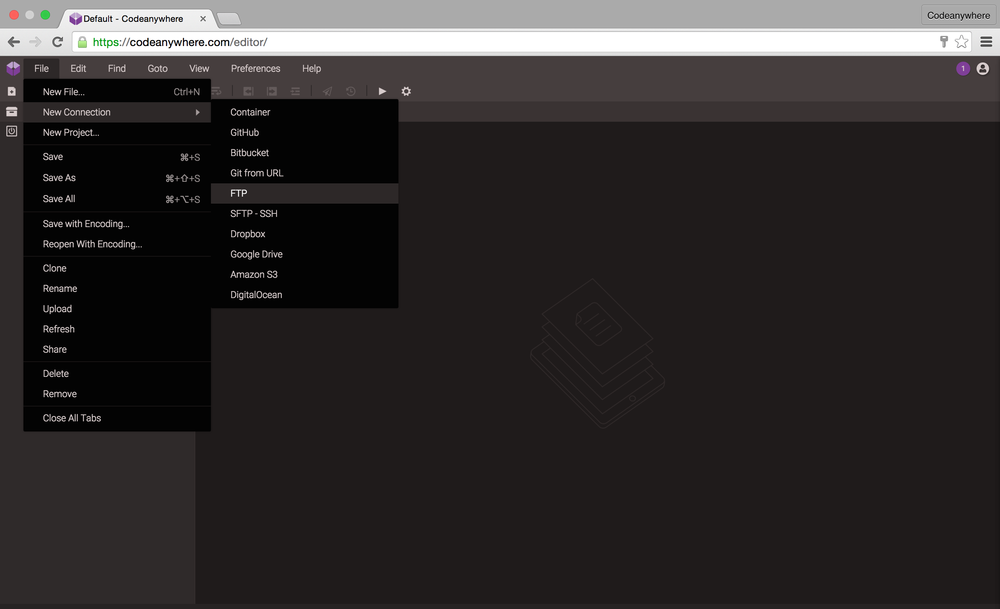
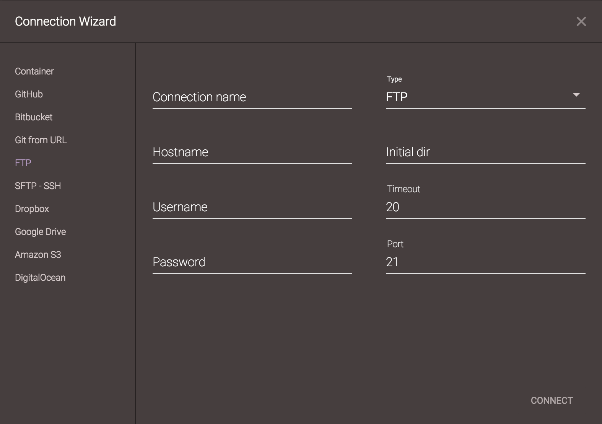

# FTP

With Codeanywhere, you can connect your existing FTP/FTPs server!

### Adding an existing FTP/FTPs

Go to File -> New Connection -> FTP. 

After selecting it, Add FTP window appears where you enter server information and add that server to your Project for quick and easy access.

-	Server name - the name which will be shown in File Explorer, it is user definable, meaning you can name your server however you want
-	Hostname - the hostname or IP address of your server (example: ftp.mywebsite.com)
-	Username - username of your FTP/FTPS server
-	Password - password of your FTP/FTPS server
- Type - choose between FTP or FTPs
  -- if FTPs is selected, choose Authentication Type: Explicit FTP over TLS or Implicit FTP over TLS
- Initial dir - set path
- Timeout - default: 20
- Port - default: 21

Your FTP/FTPs server will be automatically added to the File Explorer with an FTP icon.

### Managing FTP/FTPs

If you right-click on any FTP server listed, it will expand a menu offering more options: Rename, Permissions, Refresh, Create File, Create Folder, Upload, Share, Remove and Settings – where you can change your FTP/FTPs credentials.

To access SSH terminal, simply add an SSH connection instead and you'll have all the features of your FTP with SSH terminal! 
Right-clicking folders and files gives you some additional options such as Copy and Cut, to simplify managing of files and folders – still you can simply Drag and Drop your files in order to move them between folders and even Connections!

### Local FTP or FTPS

Codeanywhere uses its file services in the cloud that are used for making connections.
Behind the scenes it looks something like this:

  Codeanywhere Web or mobile app ----> Codeanywhere API ----> Codeanywhere File Service ----> Your FTP/FTPS Server

If your FTP/FTPS server is in your local network, the only way you could connect to your server from Codeanywhere is that you use port forwarding on your router to your local FTP/FTPS server. The other problem that could come in your case is your router's public IP. If your internet provider does not provide you a static IP, then you would also need to use some of DDNS services.

### Server response

Codeanywhere is acting as a "middle man" between user and your server - any action done by user is firstly processed at our server and then sent to your server. Same thing works in opposite direction, your server sends response to Codeanywhere and then Codeanywhere forwards the response back to user.
Also, the speed of the server response depends on the server location. If your server is located it America, the response will be faster, but if it's located in China it will be slower. 
We do plan to expand our server coverage around the world for faster connections!

### IP whitelist

While performing actions using Codeanywhere, the requests are sent from our app to your server. You must make sure that your server is reachable from the following IP addresses:

- 54.69.152.243
- 54.186.244.104
- 54.187.136.143
- 54.187.142.118
- 54.187.182.165
- 54.187.44.75
- 54.191.40.18

If you have no administration rights on the server, please ask your administrator whitelist these IP’s.