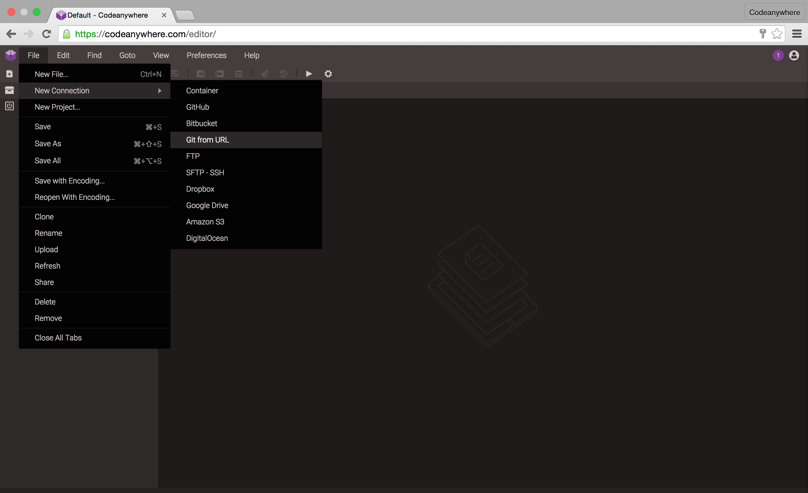
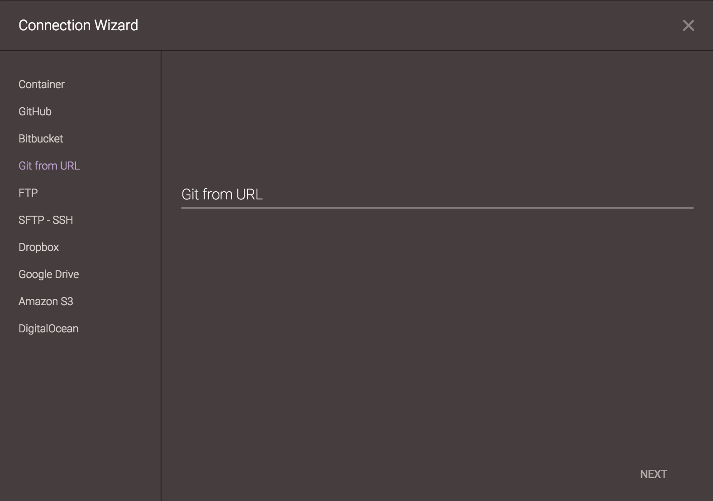

# Git from URL

Codeanywhere will create a [Container](http://docs.codeanywhere.com/connections/container.html) for each repository and you will be able to edit your code directly from there. Then, you can push changes back to your repo using your SSH Terminal! Just check our [Working with Repositories section](http://docs.codeanywhere.com/connections/gitfromurl.html#working-with-repositories) for further instructions.

### Creating an Git Container from URL

Go to File -> New Connection -> GitFromURL

You can connect to your repository by entering your repository url in Git from URL form!

Select a Stack and a name and you’ve created a new [Container](http://docs.codeanywhere.com/connections/container.html) with your repository!

### Working with repositories

You can push changes to repository using standard git commands inside your SSH terminal:

git add -A // To track all files

git commit -am "message" // To commit changes

git push origin master // Push your local changes