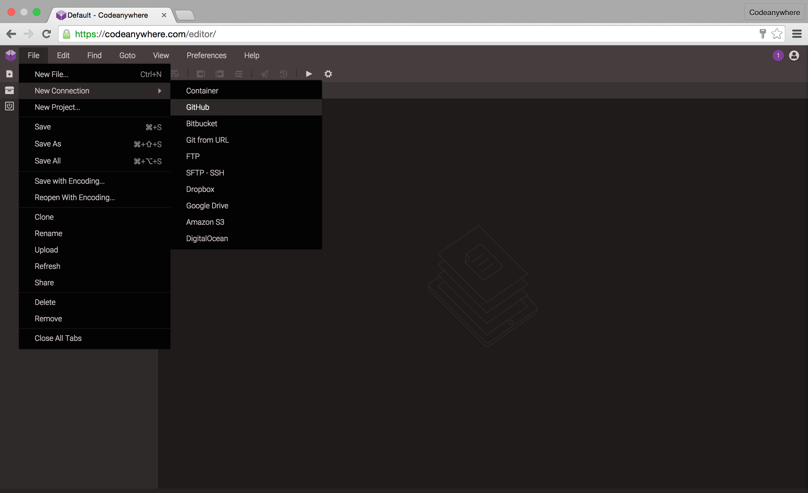
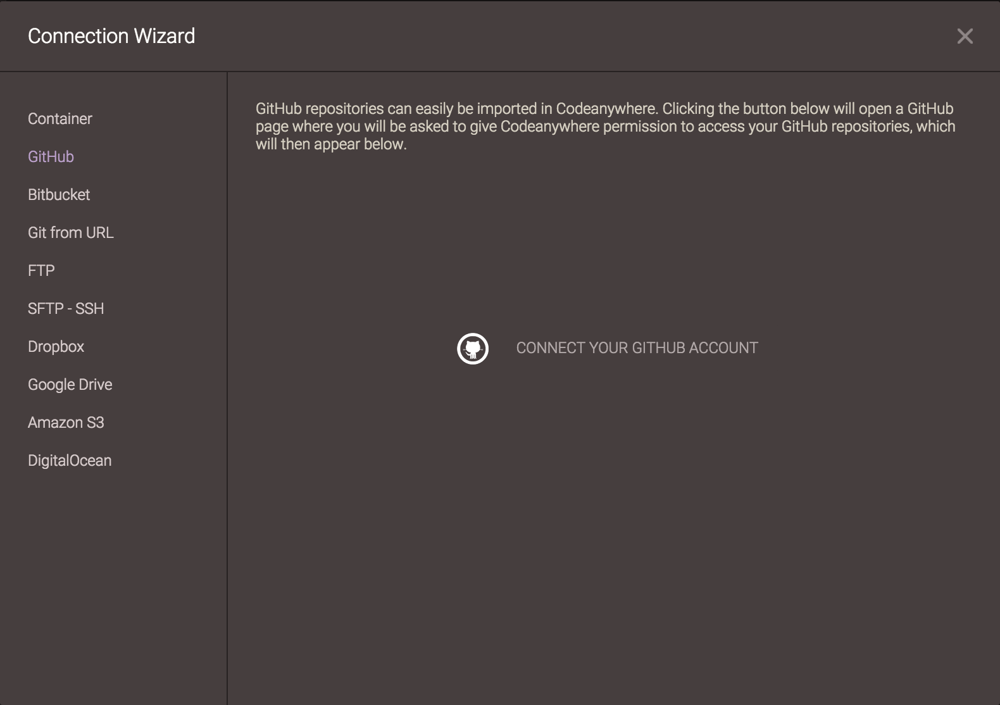
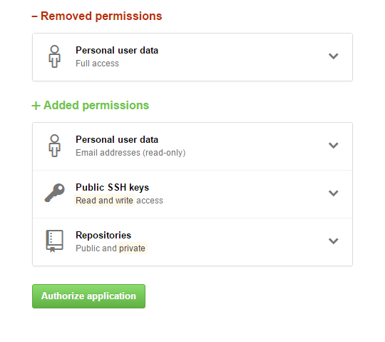
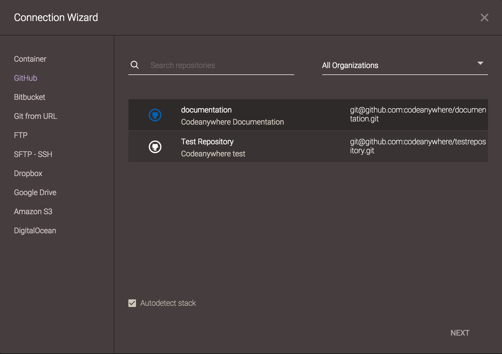
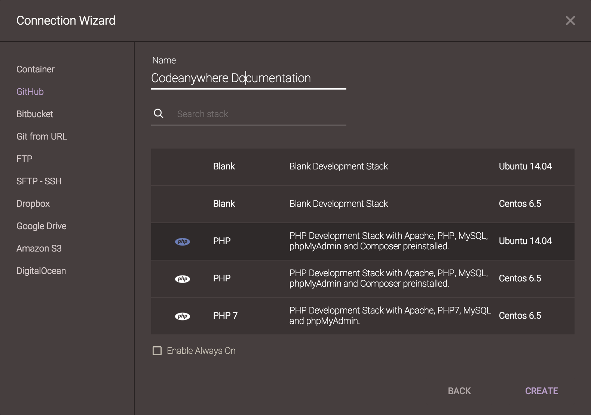

# GitHub

With Codeanywhere, you’ll be able to work directly with your GitHub repositories. CA will create a [Container](http://docs.codeanywhere.com/connections/container.html) for each repository and you will be able to edit your code directly from there. Then, you can push changes back to your repo using your SSH Terminal! Just check our [Working with Repositories section](http://docs.codeanywhere.com/connections/github.html#working-with-repositories) for further instructions.

### Creating an GitHub Container

Go to File -> New Connection -> GitHub. 

After selecting it, Add GitHub Access window appears. Click on "Connect your GitHub Account" in order to proceed.

Enter your GitHub account details to connect to your GitHub account and authorize Codeanywhere for quick and easy access.
 

You’ll be prompted which repository you want to connect to.

Just select repository you want to access, setup your development environment, or let our system decide for you!

Now you’ve created a new [Container](http://docs.codeanywhere.com/connections/container.html) with your repository!

Once you have got the repo in Codeanywhere, you can work on it from anywhere. You'll be able to edit your files, or run projects within Codeanywhere!

### Accessing GitHub Organizations

You have to explicitly allow Codeanywhere to access your organizations. You can do it in two ways:

1.) During authorization process
Click Grant / Request Access on organization which repositories you want to access through Codeanywhere

2.) While logged in your GitHub account, click Account -> Settings -> Applications -> Codeanywhere
Click Grant / Request Access on organization which repositories you want to access through Codeanywhere

After allowing organization access, you can list your repositories through Codeanywhere.

### Working with repositories

You can push changes to Github using standard git commands inside your SSH terminal:

git add -A // To track all files

git commit -am "message" // To commit changes

git push origin master // Push your local changes to github
