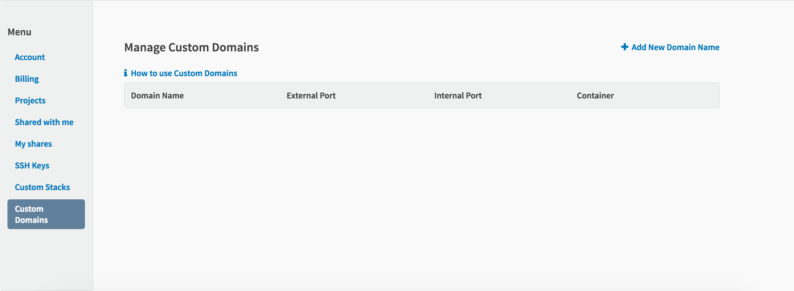
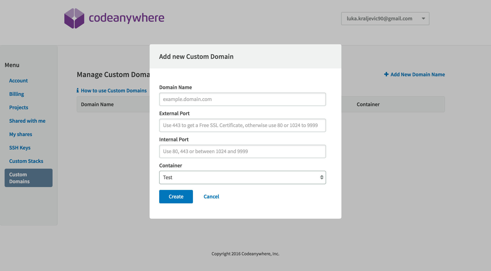
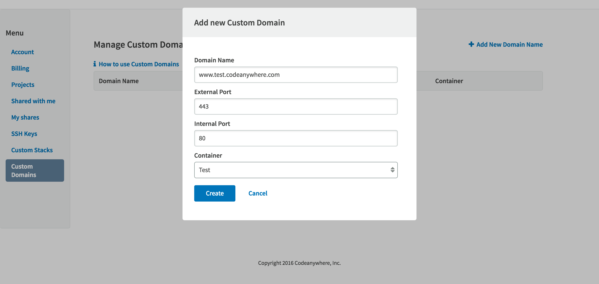

# Setting Custom Domain

Once you've created a container, you will probably want to preview it in your own link! Now, you can set your custom domain using our [Dashboard](https://codeanywhere.com/dashboard#)!

In your dashboard, select "Add New Domain Name".

Add your Custom Domain:

Add Internal port to 80. In case you have an app running on a specific port, you can set that as well. For example, if you set your Internal port to 8000, you can access your custom domain without appending :8000 at the URL.

If you set the External port to 443, Codeanywhere will automatically set up a free SSL certificate provided by Let's Encrypt!

Click on Create and that's it! Now you can access your Container from your domain!
Custom domains do not prevent container to be turned off in case it does not have AlwaysOn feature enabled. This feature is available on Freelancer plan or higher.