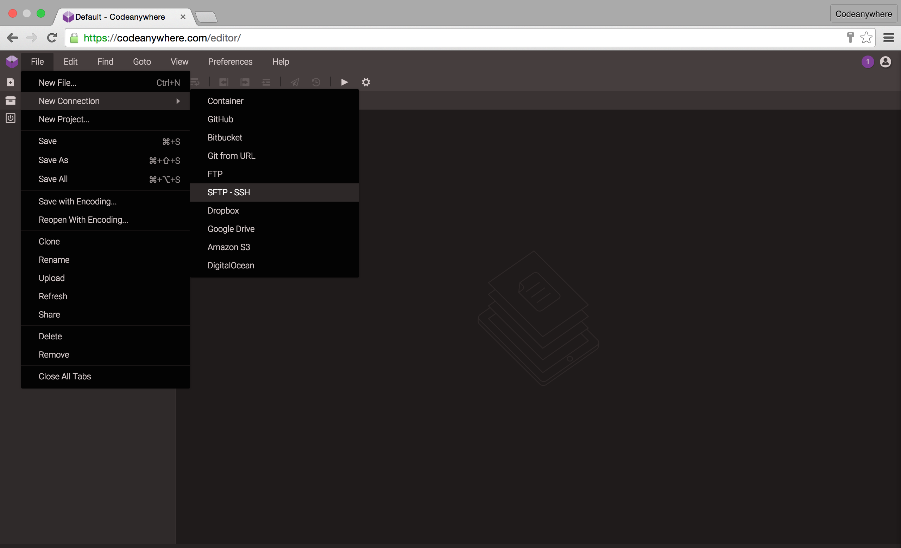

# SSH Server

Go to File -> New Connection -> SSH Server. 

After selecting it, Add SSH window appears where you enter server information and add that server to your Project for quick and easy access.
-	Server name - the name which will be shown in File Explorer, it is user definable, meaning you can name your server however you want
-	Hostname - the hostname or IP address of your server (example: ssh.mywebsite.com)
-	Username - username of your SSH server
-	Password - password of your SSH server
- Authentication - use different type of authentication: Password, Public Key, Private Key
- Initial dir - set path
- Timeout - default: 20
- Port - default: 22

Your SSH server will be automatically added to the File Explorer with an SSH icon.
If you right-click on any SSH server listed, it will expand a menu offering more options: Rename, Permissions, Refresh, Create File, Create Folder, Upload, Share, Remove and Settings – where you can change your SSH credentials.

Codeanywhere uses its file services in the cloud that are used for making connections.
Behind the scenes it looks something like this: 
  Codeanywhere Web or mobile app---->Codeanywhere API---->Codeanywhere File Service---->Your SSH Server
If your SSH server is in your local network, the only way you could connect to your server from Codeanywhere is that you use port forwarding on your router to your local SSH server. The other problem that could come in your case is your router's public IP. If your internet provider does not provide you a static IP, then you would also need to use some of DDNS services.
