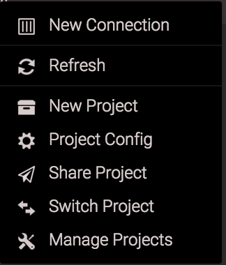

## File Explorer

The File Explorer is located on the left side of the Codeanywhere Editor.
Inside of the File Explorer you can find all the connections you've made with files and folders linked with them within one Project. 
With a right click on your Project you'll can choose if you'd like to switch an Project, share your entire Project with other users, add a new one, manage existing ones (this will redirect you to your Dashboard), add new connection within a Project, or just refresh your current Project. 

Each of the connections you can make is explained below:
- Container - your own Virtual Private Servers with its own amount of RAM, Disk space and Processing power – contains a list of folders and files within your Container
-	GitHub – a container with your GitHub repository
-	Bitbucket – container with your Bitbucket repository
-	Git from URL - container with your repository
-	FTP  – contains a FTP/FTPS servers 
-	SSH – contains a SSH/SFTP servers
-	Google Drive – shows the list of folders and files on your Google Drive account
-	Dropbox – shows the list of folders and files on your Dropbox account
-	Amazon S3 – shows the list of folders and files on your S3 account
- DigitalOcean - a Droplet from DigitalOcean

Clicking on any connection or folder expands its menu. Clicking on an expanded button causes it to collapse, which gives you more room in the File Explorer to work with.

Right-click on any file/folder in File Explorer opens a drop-down menu that provides a list of options that can be performed.
For a container, you can choose whether you'd like to run it, edit Config file, ect.
