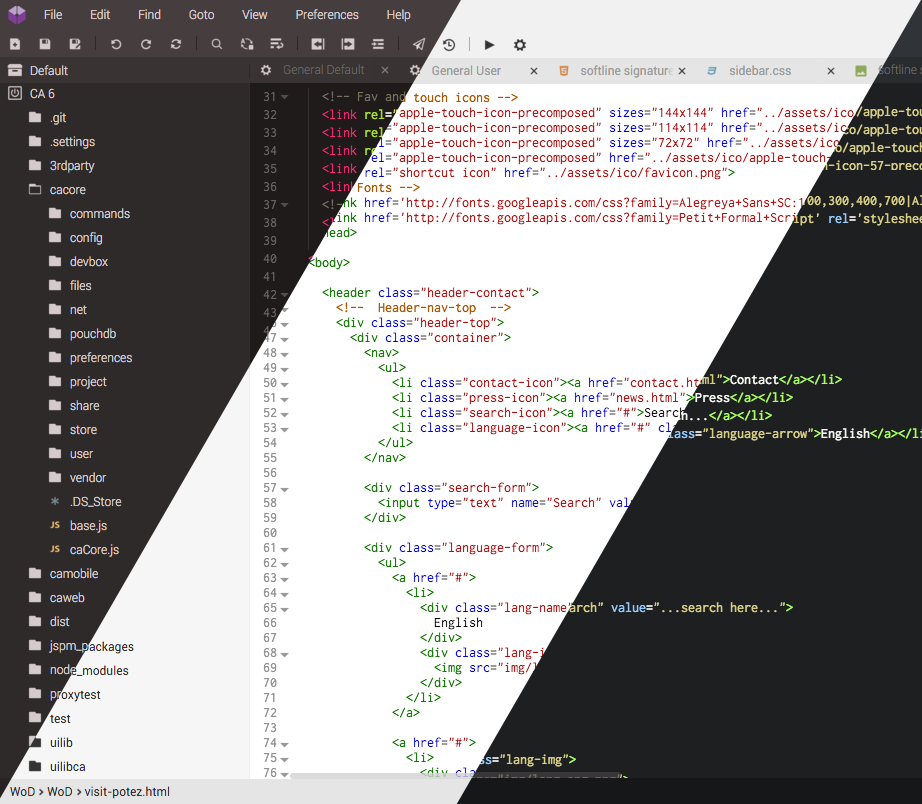

# Supported Languages and Themes

## Supported Languages

Codeanywhere develops and builds on [Codemirror](https://codemirror.net/), an editor for writing code online. CodeMirror supports over two dozen different modules, and any changes made to CodeMirror are reflected back into Codeanywhere.
By default, files are highlighted based on their file extension. You can still add new extensions in User or Project preferences and override the ones from General preferences 
We support highlighting for the following languages and extensions by default:

- APL (dyalog, apl)
- ASN.1 (asn, asn1)
- ASP.NET (aspx)
- Asterisk
- Brainfuck (b, bf)
- C (c, h)
- C++ (cpp, c++, cc, cxx, hpp, h++, hh, hxx)
- C# (cs)
- Clojure (clj)
- Closure Stylesheets (gss)
- CMake (cmake, cmake.in)
- COBOL (cob, cpy)
- CoffeeScript (coffee)
- Common Lisp (cl, lisp, el)
- CQL (cql)
- CSS (css)
- Cypher (cyp, cypher)
- Cython (pyx, pxd, pxi)
- D (d)
- Dart (dart)
- Django 
- Dockerfile
- Diff (diff, patch)
- DTD (dtd)
- Dylan (dylan, dyl, intr)
- EBNF
- ECL (ecl)
- Eiffel (e)
- Elm (elm)
- Embedded Javascript (ejs)
- Embedded Ruby (erb)
- Erlang (erl)
- Factor (factor)
- Forth (forth, fth, 4th)
- Fortran (f, for, f77, f90)
- F# (fs)
- Gas (s)
- Gherkin (feature)
- GO (go)
- GitHub Flawored Markdown
- Groovy (groovy)
- HAML (haml)
- Handlebars 
- Haskell (hs)
- Haxe (hs)
- HXML (hxml)
- HTML (JSP, ASP.NET) (html, gtm)
- HTML mixed mode
- HTTP
- IDL (pro)
- Java (java)
- Java Server Pages (jsp)
- Jade (jade)
- JavaScript (js)
- JSON (json, map)
- JSON-LD (jsonld)
- Jinja2
- Julia (jl)
- Kotlin (kt)
- LESS (less)
- LiveScript (ls)
- Lua (lua)
- Markdown (markdown, md, mkd)
- Mathematica (m, nb)
- mIRC
- MariaDB SQL
- Modelica (mo)
- MS
- MUMPS
- MS SQL
- MySQL
- Nginx
- NSIS (nsh, nsi)
- Ntriples (nt)	
- Objective C (m, mm)
- Ocaml (ml, mli, mll, mly)
- Octave (m)
- Oz (oz)
- Pascal (p, pas)
- PEG.js (jsonld)
- Perl (pl, pm)
- PGP (ASCII armor) (pgp)
- PHP (php, php3, php4, php5, phtml)
- Pig Latin (pig)
- Plain Text (txt, text, conf, def, list, log)
- PLSQL (pls)
- Properties files (properties, ini, in)
- Puppet (pp)
- Python (py, pyw)
- Q (q)
- R (r)
- RPM Changes
- RPM Specs (spec)
- reStructuredText (rst)
- Ruby (rb)
- Rust (rs)
- Sass (sass)
- Spreadsheet (excel, formula)
- Scala (scala)
- Scheme (scm, ss)
- SCSS (scss)
- Shell (sh, ksh, bash)
- Sieve (siv, sieve)
- Slim (slim)
- Smalltalk (st)
- Smarty (tpl)
- Solr 
- Soy (soy)
- Stylus 
- SPARQL (rq, sparql)
- SQL (sql)
- Squirrel
- Swift (swift)
- sTeX
- LaTeX (text, ltx)
- SystemVerilog (v)
- Tcl (tcl)
- Textile (textile)
- TiddlyWiki
- Tiki wiki
- TOML (toml)
- Tornado (templating language)
- Troff (1, 2, 3, 4, 5, 6, 7, 8, 9)
- TTCN (ttcn, ttcn3, ttcnpp)
- TTCN Configuration (cfg)
- Turtle (ttl)
- Typescript (ts)
- Twig
- VB.NET (vb)
- VBScript (vbs)
- Velocity (vtl)
- Verilog/SystemVerilog (v)
- VHDL
- Vue.js app
- XML (xml, xsl, xsd)
- Xquery (xy, xquery)
- YAML (yaml, yml)
- Z80 (z80)


We are always adding new themes and new languages to support, so check the menu often! Since we use [CodeMirror](https://codemirror.net/) to provide syntax highlighting, feel free to log an issue there for new requests.
If you want to add new extensions, simply go to Preferences -> Project/User -> File Types and add a new extension to override the one from General Preferences. All the files with this extension will automatically be recognized and opened with the selected mode.

For example, in Preferences -> Default -> File Types, you'll see it is set to: 
```
"HTML": { 
  "extension": ["html", "htm"]
}
```
And now you can add CTP extension inside Preferences -> User/Project -> File Types, by adding code:
```
"HTML": { 
  "extension": ["html", "htm", "CTP"]
}
```
And by doing this, you'll override settings from Default.

## Themes

Themes can be changed in Project or User General Preferences. Currently there are several themes available: "monokai", "white", "dark". It is also possible to change color schemes of your browser into "monokai", "white", "eclipse", "ambiance", "blackboard", "pastel-on-dark", "seti".

For example, in Preferences -> Default -> General, you'll see it is set to: 
```
"workspace": { 
	"theme": "monokai" 
} 
```
And now you can change it inside Preferences -> User/Project -> General, by adding code:
```
"workspace": { 
	"theme": "white" 
}
```
And by doing this, you'll override settings from Default!


